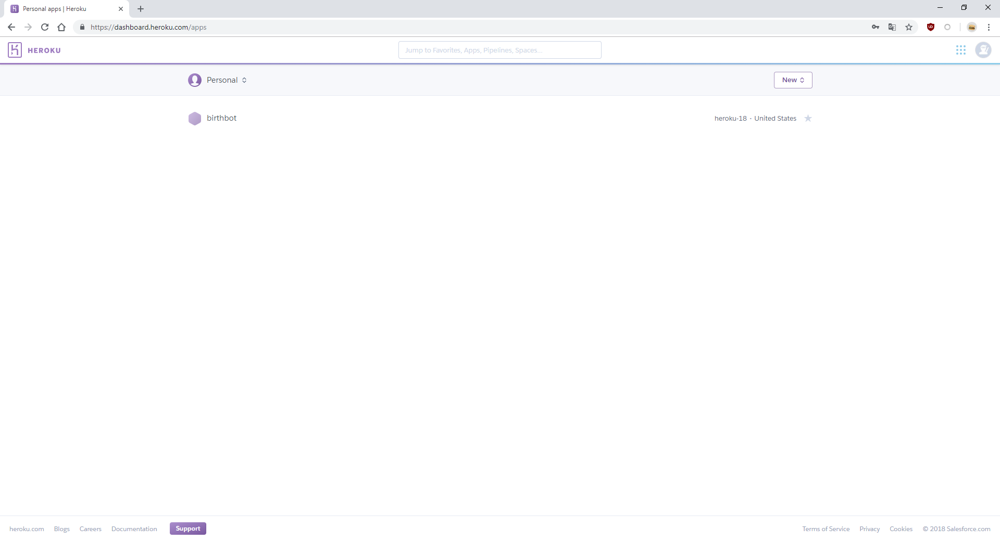
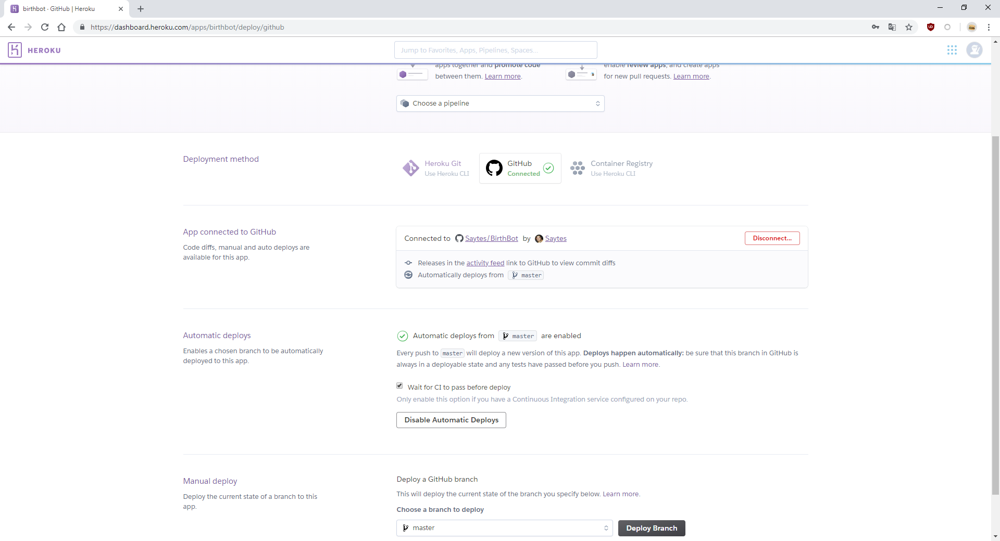

# Despliegue en Heroku

He desplegado mi aplicación web en Heroku, ya que fue el que me resulto más intuitivo y sencillo a la hora de hacerlo.

Los pasos que he seguido son los siguientes:

1. **Registro en Heroku**

   Lo primero y principal es registrarse en la página de [Heroku](https://signup.heroku.com/login?redirect-url=https%3A%2F%2Fid.heroku.com%2Foauth%2Fauthorize%3Fclient_id%3D1e7d4c52-6008-4a73-b132-09abb5d04859%26response_type%3Dcode%26scope%3Dglobal%252Cplatform%26state%3DSFMyNTY.g3QAAAACZAAEZGF0YW0AAAAxaHR0cHM6Ly9kYXNoYm9hcmQuaGVyb2t1LmNvbS9hdXRoL2hlcm9rdS9jYWxsYmFja2QABnNpZ25lZG4GAHcarsRmAQ.0XivXF_mTSVVsQSU5WwWutefChzM46-0W5qoZ7agEhw)

2. **Instalación de Heroku e inicio de sesión**

   Tras haberme registrado, voy a crear la aplicación, y para ello lo primero que debo hacer es instalar *Heroku* e iniciar sesión.

   Para ello primero instalo *Heroku* a través del comando `sudo snap install heroku --classic`.

   Una vez instalado, escribo en mi terminal el comando `heroku login` y posteriormente mis credenciales, y tras esto iniciaremos sesión con nuestro usuario.

3. **Creación de la aplicación**

   Ahora  que ya he iniciado sesión voy a crear mi aplicación, para ello he escrito en mi terminal el comando `heroku create birthbot`, el cual me ha generado como respuesta un enlace, `https://birthbot.herokuapp.com/`

4. **Configuración con GitHub**

   Tras haber creado nuestra aplicación iniciamos sesión en nuestra cuenta de *Heroku*, pero esta vez a través del navegador, y ahí podremos comprobar que nuestra aplicación se ha creado correctamente.

   


   Dentro de la aplicación, hago clic en `deploy` , y en el apartado **Deployment method** selecciono `GitHub` e inicio sesión con mis credenciales, después selecciono mi repositorio y lo conecto.

   Una vez hecho esto, mi página se queda así:

   

   Después de haberla conectado, seleccionamos que se despliegue automáticamente,  justo debajo de nuestro repositorio en el apartado **Automatic deploys**, pero debemos seleccionar **Wait for CI to pass before deploy** para que sólo se actualice cuando se hayan pasado los test previamente programados.

5. **Creación del Procfile**

   Ahora creo el archivo Procfile, este debe contener la aplicación que Heroku va a ejecutar en el servidor, en mi caso `Flask`.  Esto sirve para probar en local la aplicación antes de que sea desplegada en *Heroku*, y para que , como he mencionado anteriormente, funcione correctamente una vez desplegada. 

   El contenido de mi archivo `Procfile` es el siguiente:

   ```
   web: gunicorn aplicacion:app --log-file -
   ```

6. **Actualización de mis dependencias**

   Ahora, antes de probar mi aplicación, voy a comprobar que todos las dependencias estén incluídas en mi archivo `requirements.txt`. El contenido de mi archivo `requirements.txt`es el siguiente:

   ```
   atomicwrites==1.2.1
   attrs==18.2.0
   more-itertools==4.3.0
   pluggy==0.7.1
   py==1.7.0
   pytest==3.8.2
   six==1.11.0
   flask
   gunicorn==19.7.1
   ```

7. **Resultado final**

   Finalmente, he probado mi aplicación y he comprobado que esta funciona correctamente en local, por lo tanto solo necesito hacer `git push` y mi aplicación se desplegará automáticamente en *Heroku*.

   Se puede ver el estado de mi aplicación accediendo [aquí](https://birthbot.herokuapp.com/).