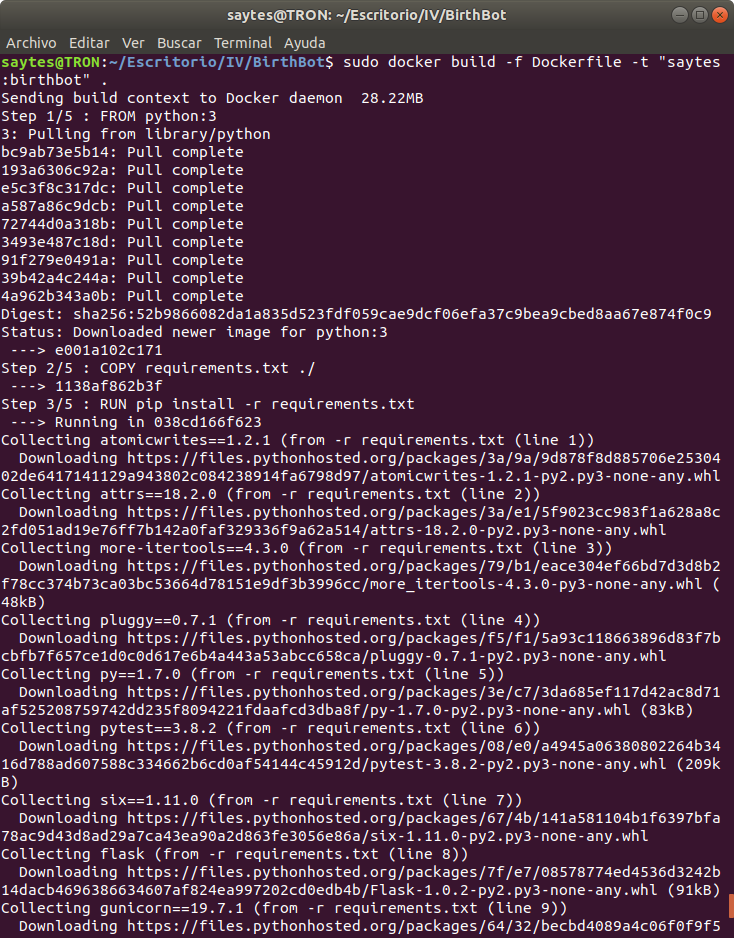

# Despliegue en Docker


## Creación de la imagen en docker

Para instalar docker he seguido este [enlace](https://docs.docker.com/install/linux/docker-ce/ubuntu/#set-up-the-repository)

Primero instalo docker, para ello debo desinstalar toda instalación previa de docker usando el siguiente comando:

`sudo apt-get remove docker docker-engine docker.io`


Después, añado claves, huella digital y por último añado el repositorio para instalarlo posteriormente, para ello uso los siguientes comandos

1. Añadir clave: `curl fsSL https://download.docker.com/linux/ubuntu/gpg | sudo apt-key add -`

2. Añado la huella digital: `sudo apt-key fingerprint 0EBFCD88`

3. Añado el repositorio: 

   ```
   sudo add-apt-repository \
      "deb [arch=amd64] https://download.docker.com/linux/ubuntu \
      $(lsb_release -cs) \
      stable"
   ```

Por último actualizo el sistema y después instalo docker con el siguiente comando: `sudo apt install docker-ce`.

Una vez creado compruebo que funciona correctamente:


Y también compruebo que el servicio está activo.


Posteriormente creo un Dockerfile acorde a mi aplicación, que instale las dependencias necesarias para que el contenedor funcione:

```
FROM python:3

COPY requirements.txt ./
RUN pip install -r requirements.txt

COPY . .

CMD gunicorn aplicacion:app --log-file -
```


Voy a comprobar que funciona localmente:




Como podemos comprobar la imagen está creada:


## Dockerhub

Tras la creación de la imagen, vamos a [Docker Hub](https://hub.docker.com/), nos registramos y verificamos nuestra cuenta siguiendo los pasos.

Una vez hecho esto iniciamos sesión y accedemos a *Settings*.

Posteriormente vamos a *Linked Accounts & Services*,  elegimos `Github` y autorizamos.


Una vez hecho esto, nos vamos a *Create* y elegimos *Create Automated Build* .

Seleccionamos *Create Auto-build Github* y elegimos nuestro proyecto.

Rellenamos los datos.


Tras rellenar, hago click en *Create* y finalmente queda :


## Despligue en Heroku

Finalmente vamos a desplegar nuestro contenedor en Heroku, para ello, primero obtengo un token de heroku.


Después iniciamos sesión en docker con este token:


Ahora en nuestra cuenta de heroku generamos una nueva aplicación en la cual se alojará docker, yo la llamaré `docker-iv`.


Tras esto sincronizamos con nuestra aplicación en Github, seleccionamos la opción de integración con Travis y vemos que todo está ok.


Tras esto, creo una imagen en docker que usaré en Heroku y después la subo.


Finalmente, si acceedemos al [enlace](docker-iv.herokuapp.com/) de nuestra aplicación en heroku:


Y también su [/status](https://docker-iv.herokuapp.com/status):


